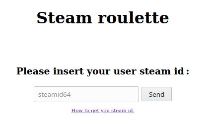
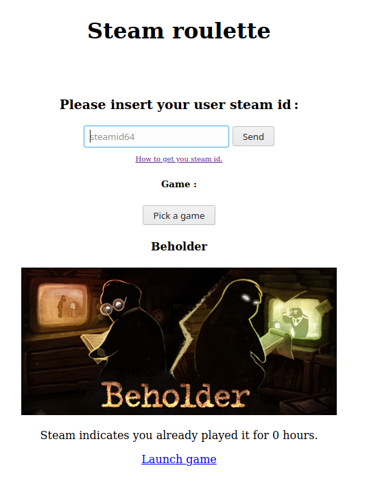

# steam_roulette

A live version of this application is hosted on my website. You can test it
[here](https://p-a-racine.fr/index.php?article=steamRoulette) if you want.

## Presentation
This project is simple : it just picks randomly one of your game in your steam library. If you don't
know what to play despite your huge library, this is just for you.

## Installation

### As a test
Just clone the project where a webserver can access it. If you use Apache, place it under its working
directory (/var/www/html or /var/www). And then, just open the example.php page.

### Imported in another project
Clone the steam roulette somewhere in your project and import the file ___roulette.php___.

Then import it :
```php
// Import it :
require_once dirname(__FILE__) . '/path/to/roulette.php';

// Call it
try {
    $mySteamRoulette =  getVueRoulette();
    // $mySteamRoulette contains now a string made of HTML and javascript code that you can import 
    // add in any of your webpages.
} catch (Exception $e) {
    echo $e;
}

// As an example, you can do something like this :
echo '<!DOCTYPE html>
<html lang="en">
    <head>
        <title>Steam roulette</title>
    </head>
    <body>
        <div>' . $mySteamRoulette . '</div>
    </body>
</html>';
``` 

## Use

The application appears like this :



Place your steam id in the field, then click on « Send ».



If the game does not satisfies you, click on the button « Pick a game » until you find the perfect
one :=).

## License

License Apache 2.0